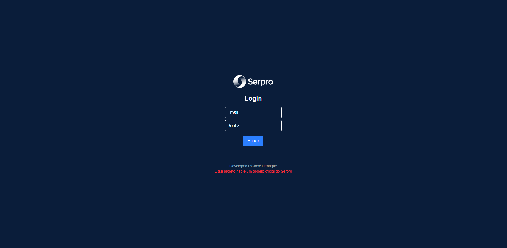
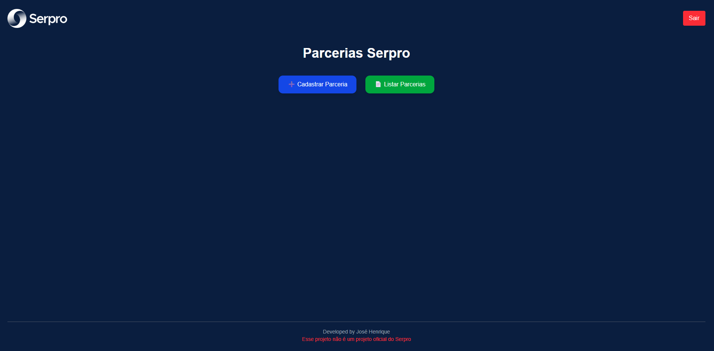
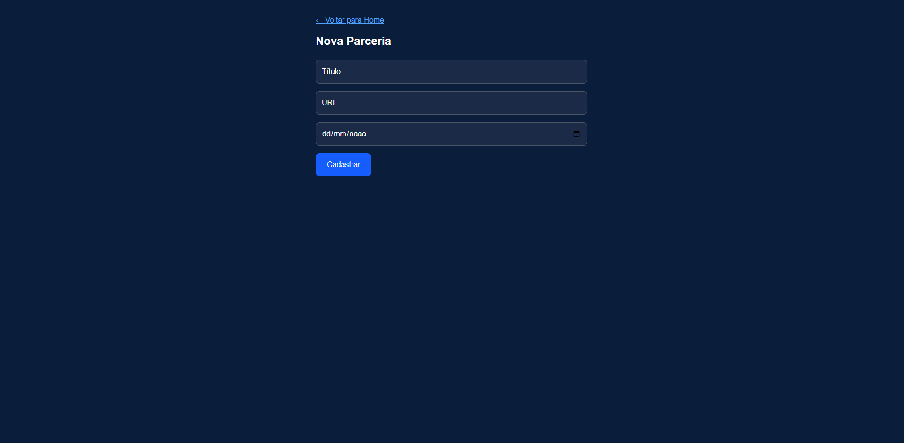
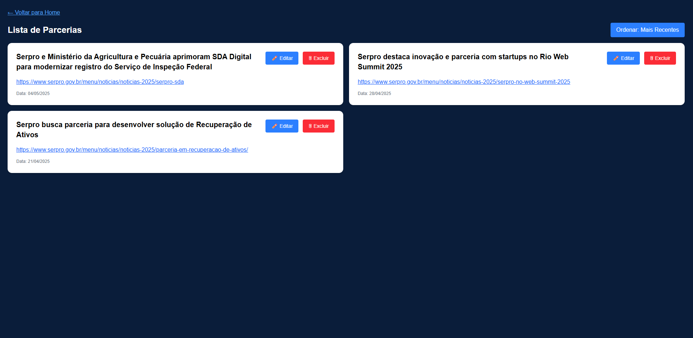
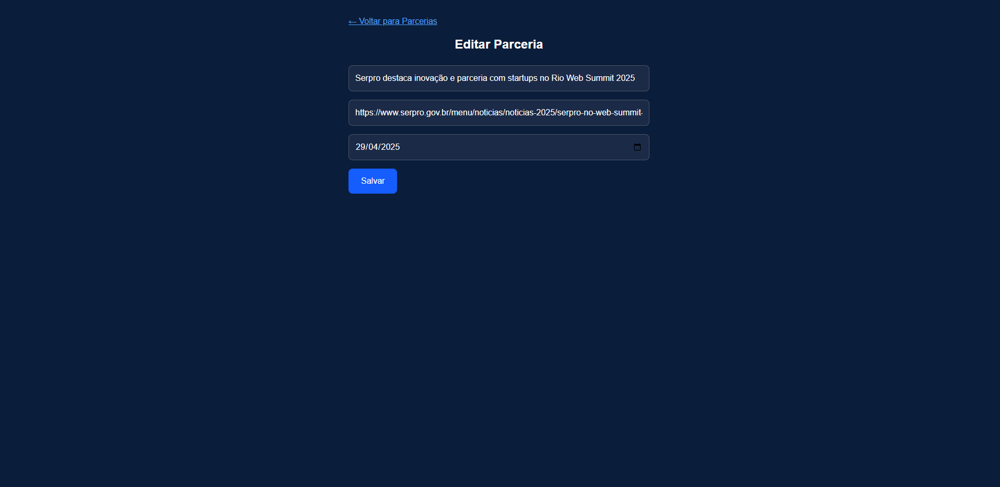

# Parcerias SERPRO (Projeto Pessoal) 🧩
Bem-vindo ao Parcerias SERPRO, um protótipo de aplicação fullstack desenvolvida como projeto pessoal, sem vínculo oficial com o SERPRO. Este projeto foi criado para facilitar o cadastro e a visualização de parcerias divulgadas no portal da instituição, servindo como um exercício prático de desenvolvimento de software.

⚠️ Aviso: Este é um projeto fictício e não possui qualquer vínculo oficial com o SERPRO. Ele foi desenvolvido exclusivamente para fins de aprendizado e demonstração.

## 📑 Visão Geral
O Parcerias SERPRO é um projeto fullstack que abrange desde o banco de dados até a interface do usuário. A aplicação permite gerenciar parcerias de forma eficiente, com uma interface responsiva. O frontend está hospedado em [Vercel](https://vercel.com) e consome uma API RESTful desenvolvida em Java com Spring Boot que está hospedada em [Render](https://render.com/).

### Principais Funcionalidades
- CRUD de Parcerias: Interface intuitiva para criar, visualizar, atualizar e deletar parcerias.
- Visualização de Dados: Exibição clara e organizada das parcerias registradas, podendo ordenar por data mais recente e mais antiga.
- Integração com API: Comunicação fluida entre frontend e backend para operações.
- Design Responsivo: Experiência otimizada para dispositivos móveis e desktop.

## 🚀 Tecnologias Utilizadas
O projeto foi construído com tecnologias modernas e amplamente adotadas no mercado:

### Frontend:
- React com Next.js para construção de interfaces dinâmicas e otimizadas.
- Tailwind CSS para estilização rápida e responsiva.
- TypeScript para tipagem estática e maior robustez no código.

### Backend:
- Java com Spring Boot para uma API RESTful escalável.
- PostgreSQL

### Hospedagem:
- Vercel (frontend)
- Render (backend)

## 🌟 Por que este Projeto?
### Este projeto foi desenvolvido com os seguintes objetivos:

- Aprendizado Fullstack: Praticar o desenvolvimento de aplicações completas, desde o backend até o frontend.
- Exploração de Tecnologias Modernas: Utilizar ferramentas e frameworks atuais, como Next.js, Tailwind CSS e Spring Boot.
- Portfólio: Demonstrar habilidades técnicas em um projeto prático e bem estruturado.

## 📸 Capturas de Tela
### Login

### Home

### Cadastro

### Parcerias

### Edição

## 📬 Contato

Autor: José Henrique
E-mail: jhsilvamata@gmail.com  
LinkedIn: [jhenriquedsm](https://www.linkedin.com/in/jhenriquedsm)